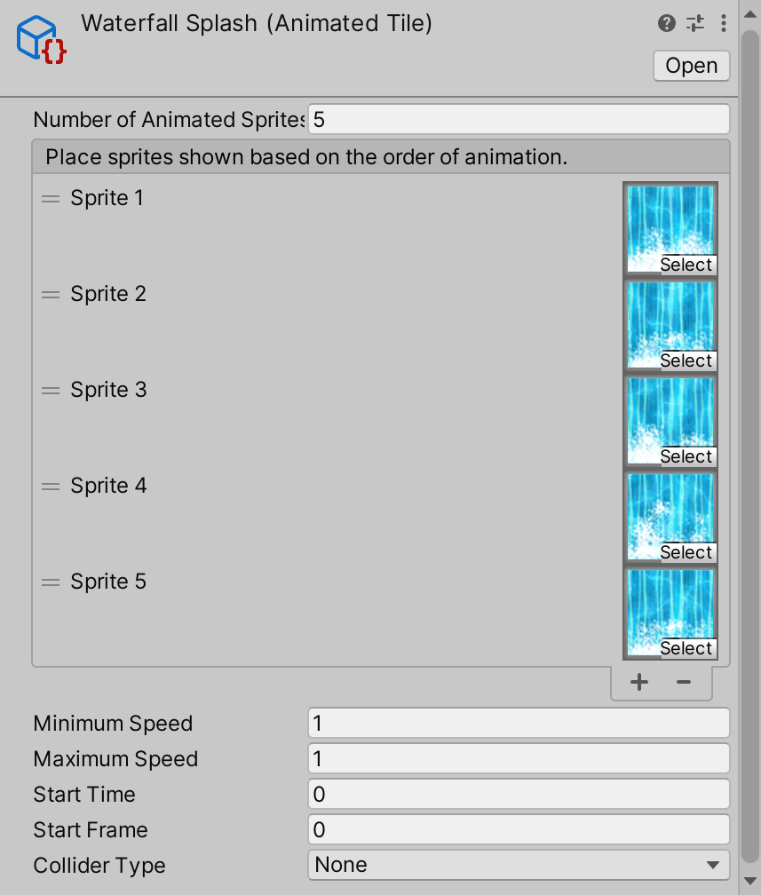

# Animated Tile

__Contribution by:__  [MahdiMahzuni](https://github.com/MahdiMahzuni)

Animated Tiles are Tiles which run through and display a list of Sprites in sequence.

### Properties

| Property                       | Function                                                     |
| ------------------------------ | ------------------------------------------------------------ |
| __Number of Animated Sprites__ | The total number of animated Sprites in the selected Animated Tile. |
| __Sprite__                     | Select the Sprite for this position in the Animated Tile sequence. |
| __Minimum Speed__              | The minimum possible speed to play the animation sequence of the Tile. A speed value is randomly chosen between this minimum and the maximum speed. |
| __Maximum Speed__              | The maximum possible speed to play the animation sequence of the Tile. A speed value is randomly chosen between the minimum and maximum speed. |
| __Start Time__                 | Set the number of the starting Sprite for the animation sequence. This allows you to start the sequence from a specific Sprite in the list of Animated Sprites. |
| __Collider Type__              | The Collider Shape generated by the Tile.                    |

### Usage

Set up the Animated Tile with the Animated Sprites through the Animated Tile Editor.

Paint the Animated Tile using the Tile Palette tools.

